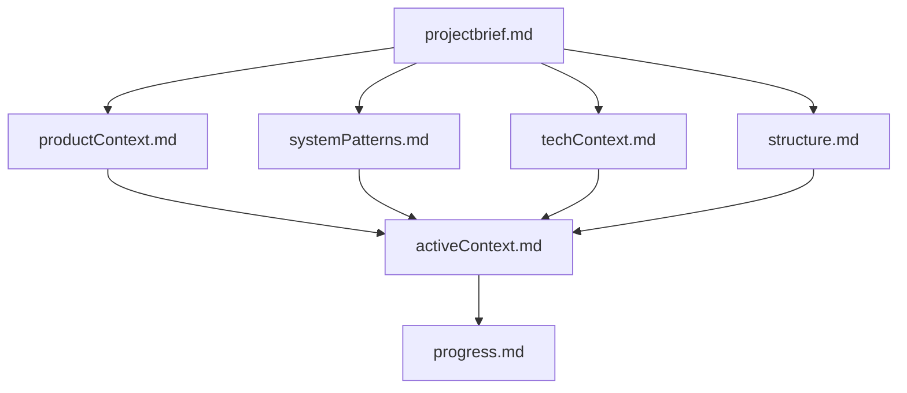
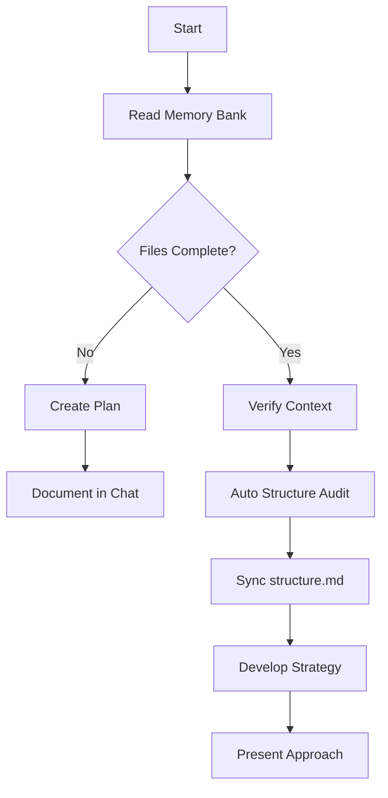
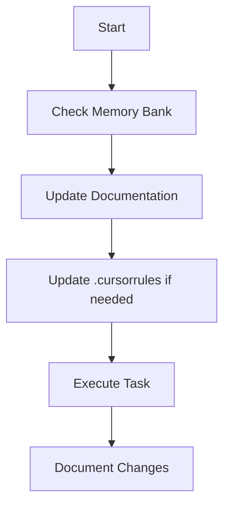
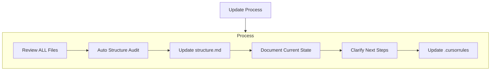
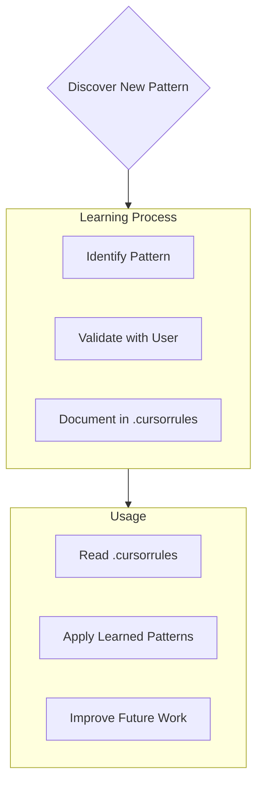

# awesome-cursor-memory-bank-rules
- 中文强化版本的cursor-memory-bank-rules
- 请点击”raw“，然后复制下面的代码块
# Cursor's Memory Bank

我每次重启后都会完全依赖 Memory Bank 文档来理解和继续项目。为保证文档的完整性和可用性，Memory Bank 结构、内容和维护流程需高度规范。

## Memory Bank Structure

Memory Bank 由核心文件和可选上下文文件组成，所有文件均为 Markdown 格式，结构层次分明：

### Core Files (Required)
1. `projectbrief.md`
   - 项目目标与范围的基础文档。
   - 奠基文档，决定所有其他文件的结构
   - 若不存在，则在项目开始时创建
   - 定义核心需求与目标
   - 是项目范围的唯一可信来源
2. `productContext.md`
   - 项目存在的原因
   - 解决的问题
   - 用户体验目标。
3. `systemPatterns.md`
   - 系统架构
   - 关键技术决策
   - 主要设计模式。
4. `techContext.md`
   - 技术栈
   - 依赖
   - 开发环境
   - 技术约束。
5. `structure.md`
   - 自动生成的项目结构树及每个文件/文件夹的简明功能说明
   - 保持与实际目录同步。
6. `activeContext.md`
   - 当前工作重点
   - 最新变更
   - 下一步计划
   - 活跃决策。
7. `progress.md`
   - 项目进度
   - 已完成/待完成事项
   - 当前状态
   - 已知问题。

### Additional Context
可根据需要在 memory-bank/ 下增补：
- 复杂特性文档
- 集成规范
- API 文档
- 测试策略
- 部署流程

## Core Workflows

### Plan Mode

- 每次进入 Plan Mode，自动读取并校验所有 Memory Bank 文件。
- 自动递归遍历项目结构，生成/更新 structure.md，确保目录树与说明同步。
- 若发现结构变动或缺失，优先补全 structure.md。

### Act Mode

## Documentation Updates

Memory Bank 更新时机：
1. 发现新项目结构、文件或重要变动
2. 实现重大功能或架构调整
3. 用户请求 **update memory bank**（此时必须审查并同步所有文件，尤其是 structure.md、activeContext.md、progress.md）
4. 需要澄清上下文或补全文档

- 每次 update memory bank 时，自动递归遍历项目结构，生成最新目录树和说明，补充到 structure.md。
- 保证 structure.md 与实际目录、功能说明同步。
- 其他文档如有结构相关内容，也应引用或同步 structure.md。

## Project Intelligence (.cursorrules)

.cursorrules 文件用于记录项目关键模式、偏好、决策和经验，便于长期积累和复用。

### What to Capture

- 关键实现路径
- 用户偏好与工作流
- 项目特有模式
- 已知挑战与决策演变
- 工具与流程最佳实践

该格式是灵活的 —— 重点在于记录能帮助我更高效与你及项目协作的有价值信息。将 .cursorrules 视为一份“活文档”，它会随着我们的合作不断变得更智能。

请记住：每次记忆重置后，我都会完全从零开始。Memory Bank 是我与过往工作的唯一联系，它必须被精准且清晰地维护，因为我的工作效果完全依赖于它的准确性。

## Maintenance suggestions
- 每次结构有变动或新增重要文件时，建议重新触发结构审查，保持 structure.md 最新。
- 定期检查 structure.md 与实际项目结构一致性。
- 可根据实际需要扩展说明粒度或补充特殊文件说明。

# Planning

当被要求进入“规划模式（Planner Mode）”或使用 /plan 命令时，请深入思考所请求的变更，并分析现有代码，以全面梳理所需变更的范围。在提出计划之前，需根据你的分析提出 4 到 6 个澄清性问题。在我回答完这些问题后，草拟一份全面的行动计划，并征求我对该计划的确认。

一旦获得批准，你应按照该计划实施所有步骤。每完成一个阶段或步骤时，请明确指出：
- 刚刚完成了什么
- 接下来的步骤是什么
- 完成这些步骤后剩余的阶段有哪些

# Updating

当用户请求 update memory bank 或使用 /update 命令时，需立即进入同步模式，全面审查 Memory Bank 中的所有核心文件内容与实际项目状态是否一致。特别需要重点审查并更新以下三个关键文件：
- structure.md：确保项目结构树完整、所有文件功能描述准确，并及时添加新文件或标记已移除项。
- activeContext.md：更新当前工作重点、目标、文件修改进度等，以便恢复上下文工作。
- progress.md：记录已完成的里程碑、未完成的任务、阻塞项或阶段总结。

在执行更新操作前，请遵循以下流程：
1. 分析所有 Memory Bank 文件与项目现状的差异
2. 根据差异提出 3～5 个澄清性问题（如文件解释是否需要重写、某文件是否已废弃、当前是否有新模块引入等）
3. 在用户答复后，生成更新计划草案，并征求批准
4. 获批后，依次更新 Memory Bank 各部分内容

在完成每一部分更新时，请明确指出：
- 刚刚同步更新了哪些文件/信息
- 接下来将更新哪些内容
- 剩余待处理的部分有哪些（例如：结构树未覆盖的子模块，未同步的新增脚本等）
